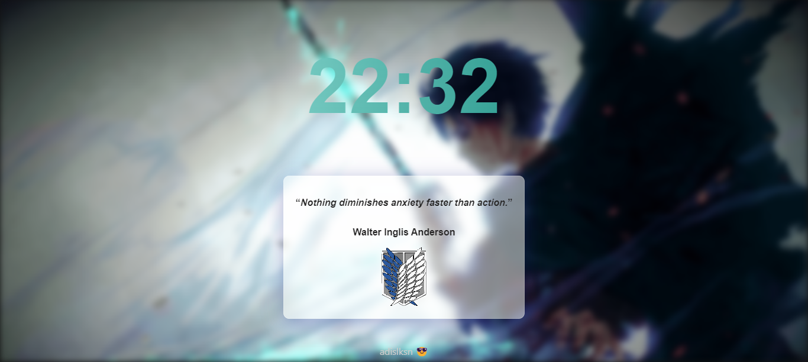

# [Chrome Extension New Tab](https://github.com/adislksn/chrome-ext-newtab)


[](https://github.com/adislksn/chrome-ext-newtab)

## Free static chrome extension for new tab page
Make your own new tab page with this extension. You can add your own links, images, and notes. It's free and open-source.

## Installation
1. Clone this repository
2. Open Chrome
3. Go to `chrome://extensions/`
4. Enable developer mode
5. Click `Load unpacked`
6. Select the cloned folder

## File Structure
```bash
chrome-ext-newtab
├─ manifest.json # Extension configuration
├─ newtab.html # Static new tab page
├─ style.css 
├─ script.js
```

## Contribution
Feel free to contribute to this project. You can add new features, fix bugs, improve the UI, and more. Just fork this repository, make your changes, and create a pull request.